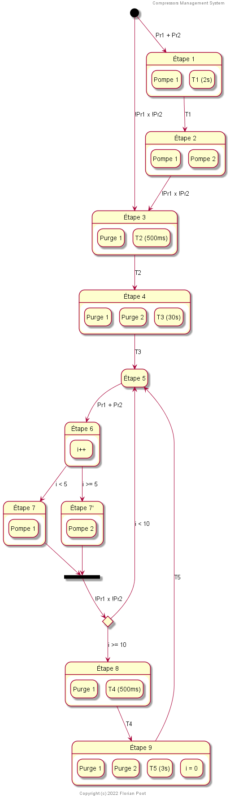
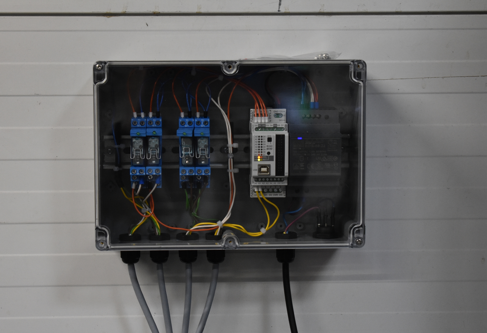

# Contrôleur de compresseurs d'air
Ce boitier permet d'équilibrer la charge entre deux compresseurs d'air afin d'éviter que seul
un ne se mette en route. De plus, le système contrôle des électrovannes de purge qui 
sont activées à chaque fin de cycle. Cela fonctionne grâce à un automate programmable 
CONTROLLINO MINI.

## Cycle
* Activation des deux compresseurs simultanément.
* Purge pendant 60 secondes pour vider l'excès d'humidité dans les cuves.
* Dés qu'un des capteurs de pression s'enclenche, activation d'un compresseur.
* Toutes les 5 fois, alternance entre le compresseur 1 et 2.
* À la fin du cycle, purge pendant 15 secondes.

## Schéma

## Image

